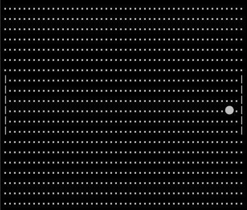

# Pong



## Summary
Pong is one of the first computer games that ever created. I tried it to recreate it by using the go programming language and
a TUI framework called `Bubble Tea`.

## Getting Started
#### Go version: 1.18.1

```bash
go mod download
go run cmd/main.go
```

## Controls 
Q - quit

R - restart
### Player 1
W - Up

S - Down
### Player 2
Up - arrow up

Down - arrow down